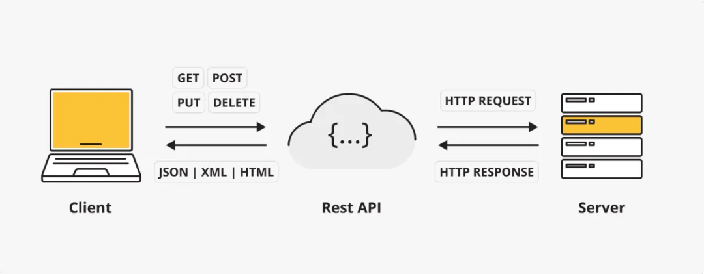

## 什么是接口

### 通用的接口定义

- 在两个不同的系统或者一个系统中两个不同功能，他们之间相互连接的部分称为接口。例如：

  - 电插座和插头

  - 水龙头和洗衣机的进水管上的接头

### 计算机领域中的接口定义

- 接口通常用于描述两个计算机系统之间的交互方式。接口就是两个系统之间的交流桥梁，确保它们可以协同工作。

### OOP编程中的接口定义

- OOP面向对象的编程，如果要提高程序的复用率，增加程序的可维护性，可扩展性，就必须是面向接口的编程，面向抽象的编程，正确地使用接口、抽象类这些抽象类型做为软件结构层次上的顶层。Java接口（Interface）和Java抽象类（Abstract Class）代表的就是抽象类型，就是我们需要提出的抽象层的具体表现。

### 前后端的接口定义

- 接口是一种通信机制，用于在前端和后端之间交换信息。接口定义就是软件开发时，对于前端如何请求信息，后端如何返回信息的结构的规定。前后端都遵循相同的接口定义，使得不同的模块之间可以互相协作，实现复杂的功能，同时保证系统的稳定和可靠性。

## 前后端接口

### 前端与后端

- 前端是我们在网页或移动应用程序中看到的页面，它由HTML和CSS编写而成，让我们看到漂亮的页面，并进行一些简单的校验，例如确保必填字段不为空。
- 后端则实现了页面上的业务逻辑和功能，例如购物和发布微博等功能。当你在页面上进行这些操作时，后端会负责扣除余额或将微博发布到指定的账户。
- 前端负责让页面看起来漂亮，后端负责实现网页的功能。
- 无论是网页还是安卓/iOS 客户端，或者是微信小程序，或者是 Windows/Mac 上的软件，都是同一个道理，都会区分前端和后端。前端就是在你的手机或者电脑上运行的那个软件，后端则是在服务器上运行的那个软件。
- 前端和后端往往会分成不同的职位，他们开发和实现的东西也截然不同。
- 前端和后端的交互，是通过接口完成的。

- 前端通过请求接口路径来和后端通信。但是需要注意的是，通过一个http请求接口来通信的方式是单向的，只能前端主动发起请求和后端通信，后端不能主动发起请求和前端通信。如果后端想主动和前端通信，可以通过双向通信协议websocket来通信，现在很多聊天工具，都是使用该协议来双向通信的。

### 接口

- 接口是一种通信机制，用于在前端和后端之间交换信息。可以将其想象为两个人之间在对话。
- 前端就像提问者，而后端则像回答者。当前端需要某些信息或执行某些任务时，它会通过一个接口向后端发送请求。这个请求就像是一个问题，告诉后端需要做什么。后端则会根据请求执行相应的操作，并将结果返回给前端。这个结果就像是答案，告诉前端完成了什么任务或提供了哪些信息。
- 这种交互就像一个问答游戏，前端和后端通过接口不断地问答，从而实现应用程序的功能和数据交换。例如，当你在购物网站上点击“加入购物车”按钮时，前端会向后端发送一个请求，告诉它要将该商品添加到购物车中。后端将执行相应的操作，并将结果返回给前端，告诉它是否成功添加了商品。
- 总之，接口就像是前端和后端之间的“对话”，用于交换信息和执行任务。
- 接口又叫 API（Application Programming Interface）。我们一般讲到接口或者 API，指的都是同一个东西。

## 接口 API 设计的方法

- **下面讨论的接口，特指前后端接口。下文中接口与API为同一概念，可以替换使用。**

- API 设计是定义 API 运作方式的蓝图，涵盖接口、方法、资源等基本模块，用于实现特定目标。设计良好的 API 就像一份清晰的操作手册，便于开发者理解，并能在预期负载下保持高效响应。
- 前后端分离项目的开发时，提倡 API 设计优先 的开发模式，即在编写代码之前先进行 API 的规划和设计。这种方法有助于构建可靠、结构清晰的 API，确保其能高效地满足预期目标和用户需求。

### 设计接口的步骤

- 设计 API 时，可以按照以下步骤进行：
    - 新建 API 项目： 通过命名和定义基础配置来创建新的 API 项目，为后续接口和结构搭建奠定基础。
    - 新建接口： 使用可视化的方式新建 API 接口，定义 API 与外部系统的交互方式，并指定请求方法 （如 GET、POST、PUT 和 DELETE）。
    - 设计数据模型： 设计详细的数据模型，以确定 API 接收和返回的数据格式。
    - 定义组件： 创建可复用的组件，如响应模板和请求参数，以提高 API 的一致性和效率。
    - 设置通用参数： 建立多个接口间通用的参数，使与 API 交互的过程更加流畅。

- 建议遵循 [OAS (OpenAPI Specification)](https://swagger.io/specification/) 来设计接口，以确保在 OpenAPI 生态系统中的各种工具和服务之间具有良好的兼容性。如果偏离了 OAS，在使用 OpenAPI 兼容的工具和服务时可能会出现兼容性问题。

### 接口包含的要素

- 清晰完整的接口应包含以下要素：
    1. 接口路径
    2. 请求方法
    3. 接口描述信息
    4. 请求参数
    5. 返回响应和示例

#### 接口路径

- 接口路径是 API 与外部应用进行交互的特定地址，客户端会通过该地址访问 API 服务。
- 推荐遵循 OpenAPI 规范，接口里只需填写 Path，无需填写完整的 URL，“前置 URL（Base URL） ”放到环境里。
- 例如：`https://test.server.com/users/{user_id}` 
    - 前置 URL（Base URL） 为 `https://test.server.com` ，来自于环境里，注意**结尾不包含/**。
    - 接口路径（Path）为 `/users/{user_id}`。根据 OpenAPI 规范，接口路径（Path） 以/起始，使接口更规范。按照 OAS 规范，以 / 开头路径有助于在 OpenAPI 生态中的兼容性。如果路径没有以 / 开头，在使用工具时可能会遇到兼容性问题。此外，以 / 开头的路径支持 URL 模式 Mock 功能，这对测试和验证功能非常重要。

#### 请求方法

- 请求方法决定了客户端如何与服务端资源交互。每种方法具有其独特的含义，并会触发服务器的不同响应。设计 API 时，根据业务需求选择合适的请求方法，以有效实现预期操作。
- 以下是常用的 API 请求方法：
    1. GET：获取指定资源，通过 Query 参数传递数据。
    2. POST：提交数据进行处理，通常将数据放在请求体中。
    3. PUT：完整更新或替换指定资源。
    4. DELETE：删除指定资源。
    5. OPTIONS：查询目标资源支持的 HTTP 方法。
    6. HEAD：与 GET 类似，但仅返回响应头，用于检查资源存在及修改情况。
    7. PATCH：部分更新指定资源。
    8. TRACE：返回服务器收到的请求，用于调试和诊断。
    9. CONNECT：建立到服务器的隧道，通常用于代理服务器的请求转发。

#### 接口描述信息

- 每个接口都包含一组默认的描述信息字段，用于规范和管理 API 的文档、可访问性以及生命周期。
- 以下是各默认描述信息字段的简要说明：
    - 命名：接口的描述性名称，用于概述接口的功能。
    - 可见性：该接口文档的可见性，方便灵活控制项目资源的访问权限。
    - 状态：默认为 “开发中”，可在接口状态下更改，标识不同阶段如 “测试中” 或 “已发布”。
    - 责任人：指定负责该接口的成员，可以从项目成员中选择用户分配此角色。
    - 标签：关键词或短语，用于对接口进行分类或描述。可以键入新标签或从已有标签中选择。
    - 服务（前置 URL）：接口路径的基础 URL，默认为“继承自父级”，也可以通过界面右上角的环境设置手动指定。
    - OperationId：在 API 中帮助区分该操作的唯一标识符 （OAS 中的 operationId）。
    - 说明：详细说明接口的目的及用途，支持 Markdown 格式。

#### 请求参数

- 请求参数用于控制数据返回或修改服务器响应的选项。
- 请求参数包括查询参数 （Query）、路径参数 （Path）、请求头参数 （Header） 和请求体参数 （Body）。
请求参数用于控制数据返回或修改服务器响应的选项。

##### Query 参数
- 查询参数是键值对，在 URL 末尾以 ? 开始，以 & 分隔，例如：?id=2&status=available。通常用于筛选、排序或修改 API 的输出。

##### Path 参数
- Path 参数是接口 URL 中的一部分，用于识别 API 中的特定资源或实体。
- Path 参数用 大括号 表示而非冒号。例如，
    - 正确示例：/pets/{id}
    - 错误示例：/pets/:id

##### 请求头参数
- 请求头参数提供关于请求的额外信息，通常用于认证、内容类型及其它元数据。后面我们在认证时会用请求头中的Authorization 参数。

##### 请求体参数
- 请求体参数包含请求体中的数据，通常用于 POST、PUT 和 PATCH 请求，用于创建或更新资源，数据通常以 JSON 或 XML 格式发送。

##### 参数描述
- 参数描述应包括名称、类型 （如 string、integer、boolean 等）、是否必填、默认值或约束条件。
- 描述参数时，常用以下关键属性：
    1. 参数名：指定参数名称，必填字段，应准确代表参数。
    2. 类型：定义参数值的数据类型，如 string、number、integer、boolean、array、object 等，便于理解请求数据的格式。
    3. 说明：简要说明参数的作用或使用方法。
    4. 是否必需：标识参数是否为必填项，为布尔值（true 或 false）。
    5. 高级设置：定义参数的数据类型、格式及约束，详细说明参数值的结构及内容。

##### 数据结构
- 当请求体参数类型为 JSON 或 XML 时，需要设置数据结构。数据结构可引用数据模型。

#### 返回响应和示例
- 在向 API 发送请求后，服务器会返回响应。定义预期的返回结果并提供示例，是让开发人员更好地理解和使用 API 的关键步骤。
- 返回结果的定义主要包括以下几个部分：
    1. HTTP 状态码：确定接口可能返回的所有状态码，包括常见的 200（OK）、404（Not Found）和 500（Server Error）等。
    2. 数据格式：为每个状态码定义返回结果的数据格式，可以是 JSON、XML、HTML、Raw、Binary 或其他适合的格式。
    3. 数据结构：对于携带数据的响应（主要是状态码 200 的情况），详细描述返回的数据结构。这包括指定类型、嵌套对象、可选字段和数组。清晰的定义能帮助客户端开发人员了解应期望的数据及其解析方式。仅 JSON 和 XML 格式可以配置数据结构。
    4. 示例：提供示例响应对于展示 API 在实际场景中的表现至关重要。理想情况下，示例应基于预定义请求，展示服务器返回的数据集。示例应该准确反映响应的数据结构、格式和类型，确保与响应的数据结构定义一致。

## RESTful API

> 在现代 Web 开发中，RESTful API 已成为应用程序之间通信的标准方式。REST（Representational State Transfer，表述性状态转移）是一种软件架构风格，由 Roy Fielding 博士在 2000 年提出。REST 定义了一组约束条件和原则，用于创建可扩展、松耦合的 Web 服务。RESTful API 是遵循 REST 架构风格设计的 API。它使用HTTP协议的特性，通过 URL 定位资源，用 HTTP 方法（GET、POST等）描述操作，实现客户端与服务器之间的交互。

[RESTful API 设计指南（阮一峰）](https://www.ruanyifeng.com/blog/2014/05/restful_api.html)
[RESTful API 最佳实践（阮一峰）](https://ruanyifeng.com/blog/2018/10/restful-api-best-practices.html)
[RESTful API 教程](https://www.runoob.com/restfulapi/restful-api-tutorial.html)

