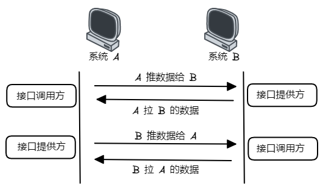

## 什么是接口

### 通用的接口定义

- 在两个不同的系统或者一个系统中两个不同功能，他们之间相互连接的部分称为接口。例如：

  - 电插座和插头

  - 水龙头和洗衣机的进水管上的接头

### 计算机领域中的接口定义

- 接口通常用于描述两个计算机系统之间的交互方式。接口就是两个系统之间的交流桥梁，确保它们可以协同工作。

### OOP编程中的接口定义

- OOP面向对象的编程，如果要提高程序的复用率，增加程序的可维护性，可扩展性，就必须是面向接口的编程，面向抽象的编程，正确地使用接口、抽象类这些抽象类型做为软件结构层次上的顶层。Java接口（Interface）和Java抽象类（Abstract Class）代表的就是抽象类型，就是我们需要提出的抽象层的具体表现。

### 前后端的接口定义

- 接口是一种通信机制，用于在前端和后端之间交换信息。接口定义就是软件开发时，对于前端如何请求信息，后端如何返回信息的结构的规定。前后端都遵循相同的接口定义，使得不同的模块之间可以互相协作，实现复杂的功能，同时保证系统的稳定和可靠性。

## 前后端接口

